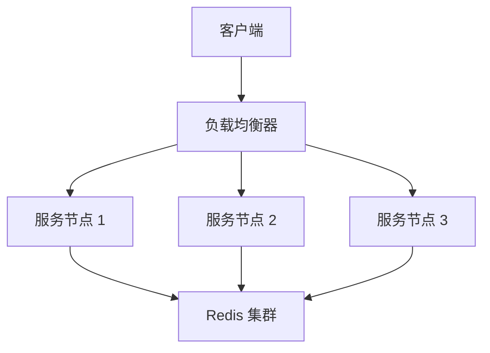

# Game Leaderboard

## 设计思路
看到排行榜,第一想法就是使用`Redis`来做,算是一个通用的和常见的解决方案.当然也有其他实现方案比如直接跳表`SkipList`
为了达到高可用,可以使用多节点加负载均衡来实现
使用Redis集群也可以保证数据一致性和完整性
至于性能,有了多节点横向扩展.可以通过增加节点来应对百万玩家的实时查询和更新



## 具体实现

### 1. 使用 gRPC
选择 gRPC 作为通信协议，因为它支持高效的二进制数据传输、流式处理和跨语言支持。这使得服务能够快速响应高频率的请求，满足高并发的使用场景。通过`grpc-gateway` 能很方便的支持 http,方便客户端使用

### 2. 使用 Redis
选择 Redis 作为数据存储后端，能够利用其内存数据存储的特点，实现快速读写操作，还可以还用集群来支持高可用。

### 3. 分数相同,先上榜的玩家排前面
使用时间戳来参与分数计算,使用一个固定的时间,比如排行榜开始时间/上榜时间.就可以实现.

## 测试
需要Redis环境,并且Redis没密码,也可以修改 `cmd/grpc_server/main.go`

启动服务直接运行 `cmd/grpc_server/main.go`

#### 1.可以使用 `grpcurl`
更新分数（UpdateScore）:
```curl
grpcurl -plaintext -d '{"playerId": "123", "score": 100, "timestamp": 1736068529}' localhost:50051 leaderboard.LeaderboardService/UpdateScore
```
获取玩家排名（GetPlayerRank）:
```curl
grpcurl -plaintext -d '{"playerId": "123"}' localhost:50051 leaderboard.LeaderboardService/GetPlayerRank
```
获取前 N 名（GetTopN）:
```curl
grpcurl -plaintext -d '{"n": 5}' localhost:50051 leaderboard.LeaderboardService/GetTopN
```
获取玩家排名范围（GetPlayerRankRange）:
```curl
grpcurl -plaintext -d '{"playerId": "123", "range": 10}' localhost:50051 leaderboard.LeaderboardService/GetPlayerRankRange
```
#### 2.直接使用 `cmd/client` grpc 客户端测试

### 测试 http 接口 需要先启动grpc,在启动 http 服务
使用 curl 测试

更新分数（UpdateScore）:
```curl
 curl -X POST \
  http://localhost:8080/v1/leaderboard/123456/score \
  -H 'Content-Type: application/json' \
  -d '{
    "playerId": "123456",
    "score": 10000,
    "timestamp": 1736068529
  }'
```
获取玩家排名（GetPlayerRank）:
```curl
curl -X GET http://localhost:8080/v1/leaderboard/{playerId}/rank
```
获取前 N 名（GetTopN）:
```curl
curl -X GET http://localhost:8080/v1/leaderboard/topN/{N}
```
获取玩家排名范围（GetPlayerRankRange）:
```curl
curl -X GET http://localhost:8080/v1/leaderboard/{playerId}/range/{range}
```

### 一些其他可以优化待实现的点
- 可以考虑再加一层内存缓存,减轻Redis压力
- 日志记录
- ...